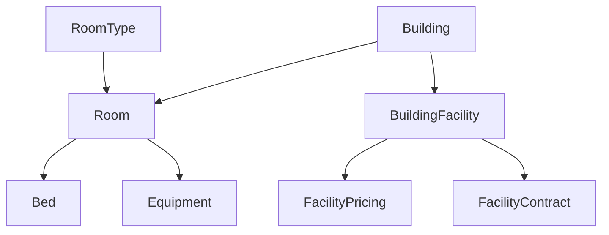

# ROOM & BUILDING API - HUONG DAN TICH HOP

Tai lieu nay chi mo ta:

- link API backend dang deploy tren Render
- cach goi API cua nhom 1
- request / response co ban de cac nhom khac tich hop

## 1. Thong tin ket noi

### Base URL tren Render

```txt
https://roombuildingservice-1ijx.onrender.com
```

### Swagger

```txt
https://roombuildingservice-1ijx.onrender.com/swagger/index.html
```

### Content-Type

Tat ca request co body deu gui:

```http
Content-Type: application/json
```

---

## 2. Nguyen tac goi API

### Kieu du lieu chung

- `id` dung dinh dang `Guid`
- ngay dung dinh dang `YYYY-MM-DD`
- tien dung so, vi du: `1200000`

### API hien tai khong can auth

Hien tai nhom 1 chua bat JWT hay Bearer token cho cac endpoint nay.

### Ma trang thai HTTP thuong gap

- `200 OK`: lay du lieu / cap nhat thanh cong
- `201 Created`: tao moi thanh cong
- `204 No Content`: xoa hoac doi trang thai thanh cong
- `400 Bad Request`: sai rule nghiep vu / thieu du lieu
- `404 Not Found`: khong tim thay id

---

## 3. Gia tri chuan can dung

### GenderType

- `MALE`
- `FEMALE`
- `MIXED`

### Building Status

- `ACTIVE`
- `INACTIVE`
- `UNDER_MAINTENANCE`

### Room Status

- `AVAILABLE`
- `FULL`
- `UNDER_MAINTENANCE`
- `INACTIVE`

### Bed Status

- `AVAILABLE`
- `OCCUPIED`
- `UNDER_MAINTENANCE`
- `INACTIVE`

### Equipment Status

- `ACTIVE`
- `UNDER_MAINTENANCE`
- `BROKEN`
- `RETIRED`

### Building Facility Status

- `ACTIVE`
- `INACTIVE`
- `UNDER_MAINTENANCE`

### Facility Pricing

#### BillingCycle

- `FREE`
- `MONTHLY`
- `YEARLY`

#### Pricing Status

- `ACTIVE`
- `INACTIVE`

### Facility Contract

#### ContractType

- `MONTHLY`
- `YEARLY`

#### Contract Status

- `ACTIVE`
- `EXPIRED`
- `CANCELLED`

---

## 4. So do du lieu chinh



Y nghia:

- `Building`: toa nha
- `RoomType`: loai phong
- `Room`: phong cu the
- `Bed`: giuong trong phong
- `Equipment`: thiet bi trong phong
- `BuildingFacility`: tien ich cua toa nha
- `BuildingFacilityPricing`: cau hinh mat phi / mien phi
- `BuildingFacilityContract`: hop dong su dung tien ich mat phi

---

## 5. Thu tu goi API khuyen nghi

Neu nhom khac chi can lay du lieu phong de dang ky hop dong / sinh vien / hoa don, thu tu nen la:

1. `GET /api/buildings`
2. `GET /api/roomtypes`
3. `GET /api/rooms/available`
4. neu can chi tiet phong -> `GET /api/rooms/{id}`
5. neu can danh sach giuong -> `GET /api/beds?roomId=...`
6. neu can thiet bi -> `GET /api/equipments?roomId=...`

Neu can lam ve tien ich toa nha:

1. `GET /api/building-facilities?buildingId=...`
2. `GET /api/building-facility-pricings?facilityId=...`
3. `GET /api/building-facility-contracts?facilityId=...`

---

## 6. Bang tong hop endpoint

### 6.1 Building

| Method | Endpoint | Mo ta |
|---|---|---|
| `GET` | `/api/buildings` | Lay danh sach toa nha |
| `GET` | `/api/buildings/{id}` | Lay chi tiet 1 toa |
| `POST` | `/api/buildings` | Tao toa nha |
| `PUT` | `/api/buildings/{id}` | Cap nhat toa nha |
| `DELETE` | `/api/buildings/{id}` | Xoa toa nha |

### 6.2 Room Type

| Method | Endpoint | Mo ta |
|---|---|---|
| `GET` | `/api/roomtypes` | Lay danh sach loai phong |
| `GET` | `/api/roomtypes/{id}` | Lay chi tiet loai phong |
| `POST` | `/api/roomtypes` | Tao loai phong |
| `PUT` | `/api/roomtypes/{id}` | Cap nhat loai phong |
| `DELETE` | `/api/roomtypes/{id}` | Xoa loai phong |

### 6.3 Room

| Method | Endpoint | Mo ta |
|---|---|---|
| `GET` | `/api/rooms` | Lay danh sach phong |
| `GET` | `/api/rooms/{id}` | Lay chi tiet phong |
| `GET` | `/api/rooms/floormap` | Lay phong theo tang |
| `GET` | `/api/rooms/available` | Lay phong con cho |
| `POST` | `/api/rooms` | Tao phong |
| `PUT` | `/api/rooms/{id}` | Cap nhat phong |
| `PATCH` | `/api/rooms/{id}/status` | Doi trang thai phong |
| `DELETE` | `/api/rooms/{id}` | Xoa phong |

### 6.4 Bed

| Method | Endpoint | Mo ta |
|---|---|---|
| `GET` | `/api/beds?roomId={roomId}` | Lay giuong theo phong |
| `GET` | `/api/beds/{id}` | Lay chi tiet giuong |
| `POST` | `/api/beds` | Tao giuong |
| `PUT` | `/api/beds/{id}` | Cap nhat giuong |
| `PATCH` | `/api/beds/{id}/status` | Doi trang thai giuong |
| `DELETE` | `/api/beds/{id}` | Xoa giuong |

### 6.5 Equipment

| Method | Endpoint | Mo ta |
|---|---|---|
| `GET` | `/api/equipments?roomId={roomId}` | Lay thiet bi theo phong |
| `GET` | `/api/equipments/{id}` | Lay chi tiet thiet bi |
| `POST` | `/api/equipments` | Tao thiet bi |
| `PATCH` | `/api/equipments/{id}/status` | Doi trang thai thiet bi |
| `DELETE` | `/api/equipments/{id}` | Xoa thiet bi |

### 6.6 Building Facility

| Method | Endpoint | Mo ta |
|---|---|---|
| `GET` | `/api/building-facilities` | Lay danh sach tien ich theo toa |
| `GET` | `/api/building-facilities/{id}` | Lay chi tiet 1 tien ich |
| `POST` | `/api/building-facilities` | Tao tien ich |
| `PUT` | `/api/building-facilities/{id}` | Cap nhat tien ich |
| `DELETE` | `/api/building-facilities/{id}` | Xoa tien ich |

### 6.7 Building Facility Pricing

| Method | Endpoint | Mo ta |
|---|---|---|
| `GET` | `/api/building-facility-pricings` | Lay cau hinh gia theo tien ich |
| `GET` | `/api/building-facility-pricings/{id}` | Lay chi tiet 1 cau hinh gia |
| `POST` | `/api/building-facility-pricings` | Tao cau hinh gia |
| `PUT` | `/api/building-facility-pricings/{id}` | Cap nhat cau hinh gia |
| `DELETE` | `/api/building-facility-pricings/{id}` | Xoa cau hinh gia |

### 6.8 Building Facility Contract

| Method | Endpoint | Mo ta |
|---|---|---|
| `GET` | `/api/building-facility-contracts` | Lay hop dong tien ich |
| `GET` | `/api/building-facility-contracts/{id}` | Lay chi tiet hop dong tien ich |
| `POST` | `/api/building-facility-contracts` | Tao hop dong tien ich |
| `PUT` | `/api/building-facility-contracts/{id}` | Cap nhat hop dong tien ich |
| `DELETE` | `/api/building-facility-contracts/{id}` | Xoa hop dong tien ich |

---

## 7. Cach goi API mau

### 7.1 Lay danh sach toa nha

```bash
curl https://roombuildingservice-1ijx.onrender.com/api/buildings
```

### 7.2 Lay danh sach loai phong

```bash
curl https://roombuildingservice-1ijx.onrender.com/api/roomtypes
```

### 7.3 Lay phong con cho

```bash
curl "https://roombuildingservice-1ijx.onrender.com/api/rooms/available?buildingId=GUID&roomTypeId=GUID&genderType=MIXED&expectedStartDate=2026-06-21&expectedEndDate=2026-12-31"
```

### 7.4 Lay giuong theo phong

```bash
curl "https://roombuildingservice-1ijx.onrender.com/api/beds?roomId=GUID"
```

### 7.5 Lay thiet bi theo phong

```bash
curl "https://roombuildingservice-1ijx.onrender.com/api/equipments?roomId=GUID"
```

### 7.6 Lay tien ich theo toa nha

```bash
curl "https://roombuildingservice-1ijx.onrender.com/api/building-facilities?buildingId=GUID"
```

### 7.7 Lay cau hinh gia cua 1 tien ich

```bash
curl "https://roombuildingservice-1ijx.onrender.com/api/building-facility-pricings?facilityId=GUID"
```

### 7.8 Lay hop dong cua 1 tien ich

```bash
curl "https://roombuildingservice-1ijx.onrender.com/api/building-facility-contracts?facilityId=GUID"
```

---

## 8. Body va response mau cho cac API quan trong

### 8.1 Tao building

```json
{
  "name": "Toa A",
  "totalFloors": 15,
  "genderType": "MIXED",
  "description": "KTX trung tam"
}
```

### Response mau

```json
{
  "id": "3f0d6d3d-1111-2222-3333-444444444444",
  "name": "Toa A",
  "totalFloors": 15,
  "floors": [1, 2, 3, 4, 5],
  "genderType": "MIXED",
  "status": "ACTIVE",
  "description": "KTX trung tam",
  "createdAt": "2026-06-21T08:00:00Z",
  "updatedAt": null
}
```

### 8.2 Tao room type

```json
{
  "typeName": "Phong 4 nguoi",
  "capacity": 4,
  "basePrice": 1200000,
  "imageUrl": "https://example.com/room-4.jpg",
  "description": "Phong tieu chuan",
  "amenities": ["May lanh", "WC rieng", "Ban hoc"]
}
```

### Response mau

```json
{
  "id": "11111111-2222-3333-4444-555555555555",
  "typeName": "Phong 4 nguoi",
  "capacity": 4,
  "basePrice": 1200000,
  "imageUrl": "https://example.com/room-4.jpg",
  "description": "Phong tieu chuan",
  "amenities": ["May lanh", "WC rieng", "Ban hoc"],
  "createdAt": "2026-06-21T08:00:00Z",
  "updatedAt": null
}
```

### 8.3 Tao room

```json
{
  "buildingId": "GUID",
  "roomTypeId": "GUID",
  "roomNumber": "A101",
  "floorNumber": 1,
  "imageUrl": "https://example.com/a101.jpg"
}
```

### Response mau

```json
{
  "id": "22222222-3333-4444-5555-666666666666",
  "buildingId": "3f0d6d3d-1111-2222-3333-444444444444",
  "roomTypeId": "11111111-2222-3333-4444-555555555555",
  "roomNumber": "A101",
  "floorNumber": 1,
  "imageUrl": "https://example.com/a101.jpg",
  "currentOccupancy": 0,
  "availableSlots": 4,
  "status": "AVAILABLE",
  "maintenanceReason": null,
  "building": {
    "id": "3f0d6d3d-1111-2222-3333-444444444444",
    "name": "Toa A",
    "totalFloors": 15,
    "floors": [1, 2, 3, 4, 5],
    "genderType": "MIXED",
    "status": "ACTIVE",
    "description": "KTX trung tam"
  },
  "roomType": {
    "id": "11111111-2222-3333-4444-555555555555",
    "typeName": "Phong 4 nguoi",
    "capacity": 4,
    "basePrice": 1200000,
    "description": "Phong tieu chuan",
    "amenities": ["May lanh", "WC rieng", "Ban hoc"]
  },
  "beds": [
    {
      "id": "bed-guid-01",
      "roomId": "22222222-3333-4444-5555-666666666666",
      "bedNumber": "A101-01",
      "status": "AVAILABLE",
      "studentId": null,
      "studentName": null,
      "studentCode": null
    }
  ],
  "equipments": [],
  "createdAt": "2026-06-21T08:00:00Z",
  "updatedAt": null
}
```

### 8.4 Doi trang thai room

```json
{
  "status": "UNDER_MAINTENANCE",
  "maintenanceReason": "Sua he thong dien"
}
```

### Ket qua

- thanh cong: `204 No Content`
- that bai: `400 Bad Request` neu thieu `maintenanceReason`

### 8.5 Cap nhat trang thai giuong theo hop dong

```json
{
  "status": "OCCUPIED",
  "studentId": "GUID",
  "studentName": "Nguyen Van A",
  "studentCode": "SV001"
}
```

### Response mau

```json
{
  "id": "bed-guid-01",
  "roomId": "22222222-3333-4444-5555-666666666666",
  "bedNumber": "A101-01",
  "status": "OCCUPIED",
  "studentId": "student-guid-01",
  "studentName": "Nguyen Van A",
  "studentCode": "SV001",
  "createdAt": "2026-06-21T08:00:00Z",
  "updatedAt": "2026-06-21T08:10:00Z"
}
```

### 8.6 Tao building facility

```json
{
  "buildingId": "GUID",
  "facilityName": "Phong Gym",
  "description": "Khu tap luyen cua toa nha"
}
```

### Response mau

```json
{
  "id": "facility-guid-01",
  "buildingId": "3f0d6d3d-1111-2222-3333-444444444444",
  "facilityName": "Phong Gym",
  "status": "ACTIVE",
  "description": "Khu tap luyen cua toa nha",
  "createdAt": "2026-06-21T08:00:00Z",
  "updatedAt": null
}
```

### 8.7 Tao pricing cho facility

```json
{
  "facilityId": "GUID",
  "isPaid": true,
  "price": 150000,
  "billingCycle": "MONTHLY",
  "status": "ACTIVE",
  "description": "Phi su dung theo thang"
}
```

### Response mau

```json
{
  "id": "pricing-guid-01",
  "facilityId": "facility-guid-01",
  "isPaid": true,
  "price": 150000,
  "billingCycle": "MONTHLY",
  "status": "ACTIVE",
  "description": "Phi su dung theo thang",
  "createdAt": "2026-06-21T08:00:00Z",
  "updatedAt": null
}
```

### 8.8 Tao contract cho facility mat phi

```json
{
  "facilityId": "GUID",
  "pricingId": "GUID",
  "contractCode": "FAC-2026-001",
  "studentId": "GUID",
  "studentName": "Nguyen Van A",
  "studentCode": "SV001",
  "contractType": "MONTHLY",
  "startDate": "2026-06-21",
  "endDate": "2026-07-21",
  "totalAmount": 150000,
  "status": "ACTIVE",
  "notes": "Dang ky phong gym"
}
```

### Response mau

```json
{
  "id": "contract-guid-01",
  "facilityId": "facility-guid-01",
  "pricingId": "pricing-guid-01",
  "contractCode": "FAC-2026-001",
  "studentId": "student-guid-01",
  "studentName": "Nguyen Van A",
  "studentCode": "SV001",
  "contractType": "MONTHLY",
  "startDate": "2026-06-21",
  "endDate": "2026-07-21",
  "totalAmount": 150000,
  "status": "ACTIVE",
  "notes": "Dang ky phong gym",
  "createdAt": "2026-06-21T08:00:00Z",
  "updatedAt": null
}
```

### 8.9 Response mau cho lay phong con cho

```json
[
  {
    "id": "22222222-3333-4444-5555-666666666666",
    "buildingId": "3f0d6d3d-1111-2222-3333-444444444444",
    "roomTypeId": "11111111-2222-3333-4444-555555555555",
    "roomNumber": "A101",
    "floorNumber": 1,
    "status": "AVAILABLE",
    "currentOccupancy": 2,
    "availableSlots": 2,
    "building": {
      "id": "3f0d6d3d-1111-2222-3333-444444444444",
      "name": "Toa A"
    },
    "roomType": {
      "id": "11111111-2222-3333-4444-555555555555",
      "typeName": "Phong 4 nguoi",
      "capacity": 4,
      "basePrice": 1200000
    },
    "expectedStartDate": "2026-06-21",
    "expectedEndDate": "2026-12-31"
  }
]
```

---

## 9. Cac response / field ma nhom khac nen quan tam

### Room

Cac field hay dung nhat:

- `id`
- `buildingId`
- `roomTypeId`
- `roomNumber`
- `floorNumber`
- `status`
- `currentOccupancy`
- `availableSlots`
- `building.name`
- `roomType.typeName`
- `roomType.capacity`
- `roomType.basePrice`

### Bed

Cac field hay dung nhat:

- `id`
- `roomId`
- `bedNumber`
- `status`
- `studentId`
- `studentName`
- `studentCode`

### Equipment

Cac field hay dung nhat:

- `id`
- `roomId`
- `equipmentName`
- `equipmentIndex`
- `status`

### Building Facility

Cac field hay dung nhat:

- `id`
- `buildingId`
- `facilityName`
- `status`
- `description`

### Building Facility Pricing

Cac field hay dung nhat:

- `id`
- `facilityId`
- `isPaid`
- `price`
- `billingCycle`
- `status`

### Building Facility Contract

Cac field hay dung nhat:

- `id`
- `facilityId`
- `pricingId`
- `contractCode`
- `studentId`
- `studentName`
- `studentCode`
- `contractType`
- `startDate`
- `endDate`
- `totalAmount`
- `status`

---

## 10. Rule nghiep vu quan trong

### 10.1 Building

- `GenderType` bat buoc nam trong `MALE / FEMALE / MIXED`
- `Status` bat buoc nam trong `ACTIVE / INACTIVE / UNDER_MAINTENANCE`
- khong xoa duoc building neu:
  - trong toa van con phong
  - trong toa van con tien ich
  - trong toa van con giuong `OCCUPIED`
- khong chuyen building sang `INACTIVE` hoac `UNDER_MAINTENANCE` neu van con nguoi o

### 10.2 Room Type

- `Capacity > 0`
- `BasePrice >= 0`
- `TypeName` la duy nhat

### 10.3 Room

- `FloorNumber` khong duoc vuot qua `TotalFloors` cua building
- `RoomNumber` la duy nhat trong tung building
- tao room se tu dong tao danh sach bed theo `RoomType.Capacity`
- khong force room sang `FULL` neu van con cho trong
- neu doi room sang `UNDER_MAINTENANCE` thi bat buoc co `maintenanceReason`
- khong chuyen room sang `UNDER_MAINTENANCE` hoac `INACTIVE` neu van con bed `OCCUPIED`
- khong xoa duoc room neu:
  - con nguoi o
  - con thiet bi dang duoc quan ly

### 10.4 Bed

- `BedNumber` la duy nhat trong tung room
- neu tao / cap nhat co `StudentId` hoac `StudentName` hoac `StudentCode` thi backend coi la `OCCUPIED`
- neu bed khong o trang thai `OCCUPIED` thi backend se xoa thong tin sinh vien khoi bed
- khong xoa duoc bed dang `OCCUPIED`
- khong chuyen bed dang `OCCUPIED` sang `INACTIVE` hoac `UNDER_MAINTENANCE`

### 10.5 Equipment

- `EquipmentStatus` hop le: `ACTIVE / UNDER_MAINTENANCE / BROKEN / RETIRED`
- equipment duoc tach theo `equipmentName + equipmentIndex`

### 10.6 Building Facility

- `FacilityName` la duy nhat trong 1 building
- `Status` hop le: `ACTIVE / INACTIVE / UNDER_MAINTENANCE`
- khong xoa duoc facility neu:
  - con pricing
  - con contract

### 10.7 Building Facility Pricing

- `Price >= 0`
- `BillingCycle` hop le: `FREE / MONTHLY / YEARLY`
- `Status` hop le: `ACTIVE / INACTIVE`
- neu `isPaid = false` thi backend tu dua:
  - `price = 0`
  - `billingCycle = FREE`
- khong xoa duoc pricing neu van con contract

### 10.8 Building Facility Contract

- chi tao contract cho pricing dang `isPaid = true`
- `ContractType` hop le: `MONTHLY / YEARLY`
- `Status` hop le: `ACTIVE / EXPIRED / CANCELLED`
- `StartDate <= EndDate`
- `TotalAmount >= 0`
- `ContractCode` la duy nhat
- khong xoa duoc contract neu status van la `ACTIVE`

---

## 11. Luong tich hop de cac nhom khac dung dung

### 11.1 Luong nhom 2 dang ky phong cho sinh vien

1. `GET /api/buildings`
2. `GET /api/roomtypes`
3. `GET /api/rooms/available`
4. `GET /api/rooms/{id}`
5. `GET /api/beds?roomId=...`
6. chon 1 bed dang `AVAILABLE`
7. `PATCH /api/beds/{id}/status`

Body:

```json
{
  "status": "OCCUPIED",
  "studentId": "GUID",
  "studentName": "Nguyen Van A",
  "studentCode": "SV001"
}
```

8. nhom 2 luu `roomId`, `bedId`, `studentId` ve he thong hop dong cua nhom 2

### 11.2 Luong nhom 2 tra phong / ket thuc hop dong

1. xac dinh `bedId`
2. `PATCH /api/beds/{id}/status`

Body:

```json
{
  "status": "AVAILABLE"
}
```

Backend se tu clear:

- `studentId`
- `studentName`
- `studentCode`

### 11.3 Luong nhom 3 lay thong tin de tinh hoa don phong

1. `GET /api/rooms/{id}`
2. doc:
   - `roomType.basePrice`
   - `currentOccupancy`
   - `availableSlots`
3. neu can thong tin chi tiet building:
   - `GET /api/buildings/{id}`

### 11.4 Luong nhom 3 xu ly tien ich mat phi

1. `GET /api/building-facilities?buildingId=...`
2. `GET /api/building-facility-pricings?facilityId=...`
3. chon pricing dang `ACTIVE`
4. `POST /api/building-facility-contracts`
5. sau do nhom 3 co the dua `contractCode`, `studentId`, `totalAmount` vao luong hoa don rieng

---

## 12. Loi thuong gap va cach hieu

### `400 Bad Request`

Thuong do:

- sai enum status
- thieu field bat buoc
- `expectedStartDate > expectedEndDate`
- `maintenanceReason` bi thieu khi doi room sang `UNDER_MAINTENANCE`
- vi pham rule nghiep vu xoa / cap nhat

### `404 Not Found`

Thuong do:

- `id` khong ton tai
- `buildingId`, `roomTypeId`, `roomId`, `facilityId`, `pricingId` truyen sai

### `409` hoac loi nghiep vu tu middleware

Service hien tai chu yeu tra loi nghiep vu qua `BusinessRuleException`, nhom khac nen doc message de biet ro ly do bi chan.

Vi du message co the gap:

- `Cannot delete a building that still has rooms.`
- `Cannot delete a room that still has occupied beds.`
- `Cannot delete an occupied bed.`
- `Only paid pricing policies can create facility contracts.`

---

## 13. API cu va API moi

### API cu dang duoc frontend va cac nhom khac dung

- `buildings`
- `roomtypes`
- `rooms`
- `beds`
- `equipments`

### API moi vua bo sung

- `building-facilities`
- `building-facility-pricings`
- `building-facility-contracts`

Luu y:

- API cu van giu nguyen route
- API cu van giu nguyen kieu goi chinh
- phan moi duoc them rieng, khong de len luong cu

---

## 14. Nhung gi hien tai API CHUA co

De tranh nhom khac ky vong sai, hien tai service nhom 1 chua co:

- auth JWT / phan quyen role
- pagination
- API versioning kieu `/api/v1/...`
- webhook callback sang nhom khac
- upload file anh tu backend
- endpoint tong hop dashboard rieng cho cac nhom

Neu nhom khac can cac chuc nang tren thi phai thong nhat bo sung sau.

---

## 15. Nhung gi neu muon tai lieu day du hon nua thi bo sung them

Neu ban muon tai lieu nay day du hon nua, thi co the bo sung them 4 nhom thong tin sau:

1. file Postman collection
2. bang JSON response mau day du cho tung endpoint
3. danh sach rule nghiep vu chi tiet
4. quy uoc mapping giua `studentId / contract / bed status` voi nhom 2

Hien tai file nay da du de:

- nhom khac biet link Render
- nhom khac biet endpoint nao de goi
- nhom khac biet query / body co ban
- nhom khac biet gia tri status hop le
- nhom khac biet rule nghiep vu quan trong
- nhom khac biet luong tich hop giua nhom 1 voi nhom 2 / nhom 3
